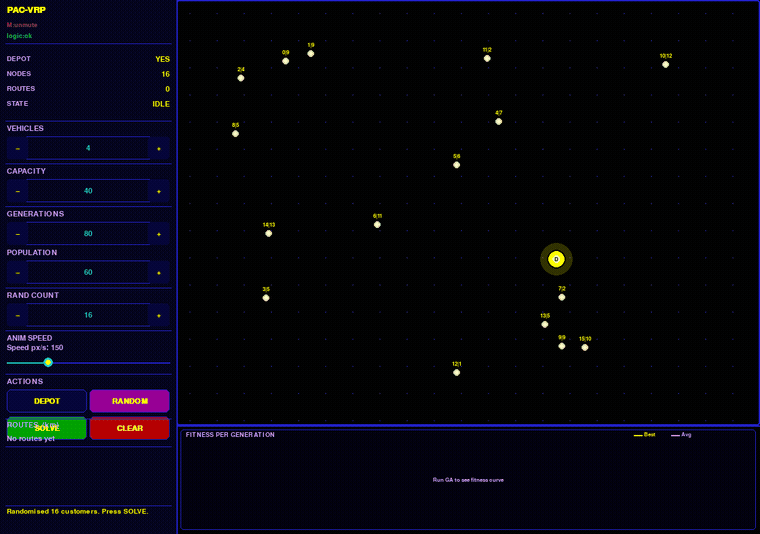
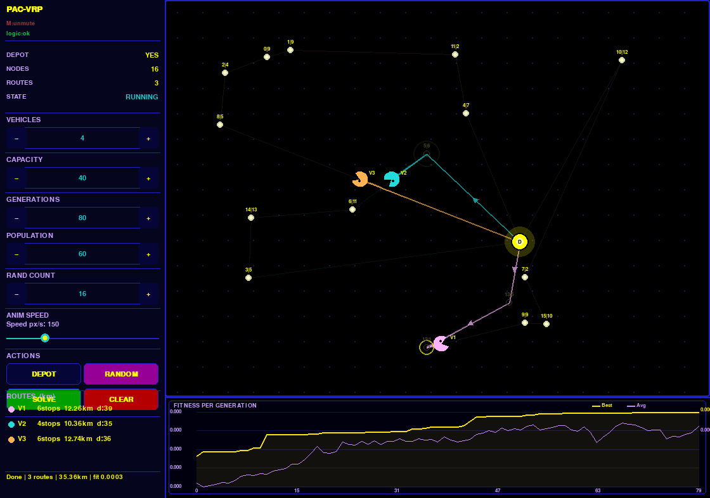
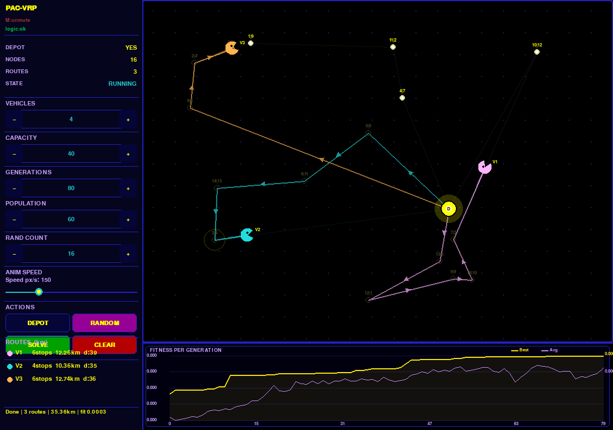

<p align="center">
  
</p>

<h1 align="center">🟡 PAC-VRP — Vehicle Routing Problem, Pac-Man Edition</h1>

<p align="center">
  <i>Solving the <b>Capacitated Vehicle Routing Problem (CVRP)</b> with a <b>Genetic Algorithm</b>,<br>
  wrapped in a fully interactive Pygame GUI where animated Pac-Man trucks chomp their way through optimized delivery routes.</i>
</p>

<p align="center">
  
  
  
  
  
  
  
</p>

---

## 📑 Table of Contents

- [What Is This?](#-what-is-this)
- [Features](#-features)
- [Architecture](#️-architecture)
- [The Genetic Algorithm](#-the-genetic-algorithm)
- [Experimental Results](#-experimental-results)
- [Getting Started](#-getting-started)
- [Why a Genetic Algorithm?](#-why-a-genetic-algorithm)
- [Known Limitations](#️-known-limitations)
- [Future Work](#-future-work)
- [Team](#-team)
- [References](#-references)

---

## 🕹️ What Is This?

**PAC-VRP** tackles the classic **Vehicle Routing Problem** — the NP-hard challenge of finding the shortest possible set of routes for a fleet of capacity-limited vehicles serving a group of customers from a central depot — using a **Genetic Algorithm (GA)** built entirely from first principles.

Instead of a plain console output, the solution is delivered through a polished, **Pac-Man-themed Pygame interface**: place your depot and customers anywhere on the canvas, configure your fleet, hit solve, and watch animated trucks devour their routes node by node while a live fitness graph tracks the GA's evolution in real time.

<p align="center">
  
  
</p>
<p align="center"><sub>Left: GA converging mid-run · Right: final optimized routes, trucks back at the depot</sub></p>

---

## ✨ Features

- 🖱️ **Interactive canvas** — click to add/remove customers and depot, drag to reposition nodes live
- 📋 **Demand entry screen** — assign per-customer demand via keyboard, mouse spinners, or arrow keys
- ⚙️ **Fully configurable parameters** — vehicles (1–8), capacity, generations (20–500), population size (20–300), animation speed
- 🎲 **Randomise mode** — instantly generate up to 50 random customers with randomized demands
- 👻 **Animated route playback** — Pac-Man trucks traverse routes with trail rendering and waka-waka sound effects
- 📈 **Live fitness convergence graph** — best & average fitness plotted after every GA run
- 🚚 **Route summary panel** — per-vehicle stop count, total distance, and load
- 🔊 **Sound manager** — synthesized beeps or custom `.wav`/`.mp3`, toggle with `M`

---

## 🏗️ Architecture

The project follows a clean **Model-View-Controller** separation:

```
PAC-VRP
├── vrp_logic.py     →  Pure algorithmic core (GUI-free)
│   ├── Graph construction & distance matrix
│   ├── Chromosome encoding
│   ├── Population initialisation
│   ├── Fitness evaluation
│   ├── Tournament selection
│   ├── Order Crossover (OX)
│   └── Inversion mutation
│
└── main.py          →  Pygame GUI front-end
    ├── SoundManager
    ├── DemandInputScreen
    ├── FitnessGraph
    ├── TruckAnim
    └── Widgets (Button / Spinbox / Slider)
```

`vrp_logic.py` is entirely decoupled from the GUI and can be imported into any host environment — the GUI layer only orchestrates user interaction and delegates all optimisation work to the logic module.

---

## 🧬 The Genetic Algorithm

| Component | Approach |
|---|---|
| **Chromosome** | Permutation of customer indices with `0` depot-return markers separating vehicle routes |
| **Initialisation** | Random shuffle + greedy capacity-aware zero insertion |
| **Fitness** | `1 / (total_distance + penalty)`, with a 1,000-unit penalty per capacity violation |
| **Selection** | Tournament selection, `k = 3` |
| **Crossover** | Order Crossover (OX) with zero-strip / zero-restore strategy to preserve route feasibility |
| **Mutation** | Inversion mutation (segment reversal), rate `0.2` — analogous to a 2-opt move |
| **Elitism** | Top 20% of the population is preserved every generation, plus one random individual for diversity |

This permutation-based encoding guarantees every customer is visited **exactly once** at the representation level, eliminating missed or duplicate deliveries by design.

<details>
<summary>📄 <b>Show the fitness function code</b></summary>

```python
def fitness(chromosome, matrix_graph, demands, vehicle_capacity):
    total_distance = 0
    current_load = 0
    over_load = 0
    prev = 0  # start from depot
    for customer in chromosome:
        if customer == 0:
            total_distance += matrix_graph[prev][0]  # return to depot
            prev = 0
            current_load = 0
            continue
        customer_demand = demands[customer]
        if current_load + customer_demand > vehicle_capacity:
            over_load += 1
        total_distance += matrix_graph[prev][customer]
        current_load += customer_demand
        prev = customer
    if prev != 0:
        total_distance += matrix_graph[prev][0]
    penalty = over_load * 1000
    return 1.0 / (total_distance + penalty)
```

The penalty of 1,000 distance units per capacity violation is intentionally large — empirically chosen to make infeasible solutions worse than any feasible solution in realistic problem instances, without making the fitness landscape so steep that the GA can't explore near-infeasible regions during early generations.

</details>

<details>
<summary>📄 <b>Show the Order Crossover (OX) code</b></summary>

```python
def order_crossover(parent1, parent2, demand, capacity):
    zero_positions_p1 = get_zero_positions(parent1)
    zero_positions_p2 = get_zero_positions(parent2)
    p1 = remove_zeros(parent1)
    p2 = remove_zeros(parent2)
    size = len(p1)
    start = random.randint(0, size - 2)
    end = random.randint(start + 1, size - 1)
    child = [None] * size
    for i in range(start, end + 1):
        child[i] = p1[i]
    p2_index = 0
    for i in range(size):
        if child[i] is None:
            while p2[p2_index] in child:
                p2_index += 1
            child[i] = p2[p2_index]
            p2_index += 1
    child_p1 = restore_zeros(child, zero_positions_p1)
    if validate_solution(child_p1, demand, capacity):
        return child_p1
    child_p2 = restore_zeros(child, zero_positions_p2)
    if validate_solution(child_p2, demand, capacity):
        return child_p2
    return child_p1 if random.randint(1, 2) == 1 else child_p2
```

The zero-strip-then-restore strategy separates the "which customers" subproblem from the "which route" subproblem: classical OX is applied to the customer-only sequence to guarantee no duplicate or missing customers, then route boundaries are reinstated from whichever parent's zero positions stay capacity-feasible.

</details>

---

## 📊 Experimental Results

Baseline setup used across experiments:

| Parameter | Value |
|---|---|
| Customers | 10–30 (varied) |
| Vehicles | 3 |
| Vehicle capacity | 50 units |
| Population size | 50 |
| Generations | 100 |
| Mutation rate | 0.20 |
| Tournament size | 3 |
| Elitism | 20% |

**Observed outcomes** (20 customers, 3 vehicles, capacity 50, 100 generations):

- 📉 Route distance ~**40–60% shorter** than naive sequential assignment
- ✅ **Zero capacity violations** in the best-found solution
- 🔁 Stable best fitness across 5 independent runs
- ⏱️ Convergence typically between **generation 40–70**
- ⚡ Runtime **under 2 seconds** for ≤30 customers on a modern laptop

---

## 🚀 Getting Started

### Prerequisites
- Python 3.10+
- Pygame 2.x
- NumPy

### Installation

```bash
git clone https://github.com/Youssif312/vrp-PAC-MAN-edition.git
cd vrp-PAC-MAN-edition
pip install pygame numpy
```

### Run

```bash
python main.py
```

1. Place the depot, then add customer nodes (or hit **Randomise**)
2. Enter customer demands on the demand screen
3. Configure vehicles, capacity, population size, and generations
4. Hit **Solve** and watch the Pac-Man trucks chomp their way through the optimal routes 🟡

**Keyboard shortcuts:** `Enter` solve · `Space` pause/resume · `R` randomise · `M` mute · `Delete`/`Backspace` clear canvas

---

## 💡 Why a Genetic Algorithm?

- **No gradient required** — operates directly on a discrete, combinatorial objective
- **Population-level search** — reduces risk of getting trapped in local optima compared to single-solution heuristics
- **Naturally parallelisable** — each individual's fitness is independent
- **Extensible** — new constraints (time windows, heterogeneous fleet, multi-depot) only require changes to the fitness function and decoder
- **Strong empirical track record** — GA-based VRP solvers typically land within 5–15% of optimal for instances up to 100 customers

## ⚠️ Known Limitations

- No optimality guarantee (as with any metaheuristic)
- Sensitive to hyperparameter choices
- Fitness evaluation cost scales with population size × customer count
- No post-processing local search (e.g. 2-opt) hybridisation yet

## 🔭 Future Work

- Hybrid GA + 2-opt local search
- Adaptive mutation rate
- Large Neighbourhood Search (LNS) comparison
- Differential Evolution as a second algorithm for benchmarking
- Time windows, heterogeneous fleets, and multi-depot support
- Parallelised fitness evaluation
- CSV/JSON result export

---

## 👥 Team

| Name | LinkedIn |
|---|---|
| A'laa Mohammed | [](https://www.linkedin.com/in/a-laa-muhammed-0a9a29329/) |
| Basmala Samy | [](https://www.linkedin.com/in/basmala-samy-386173323/) |
| Jowiria Hassan | [](https://www.linkedin.com/in/jowiria-hassan-730755211/) |
| Rawan Mohammed | [](https://www.linkedin.com/in/rony-a67793347/) |
| Abdulrahman Islam | [](https://www.linkedin.com/in/abdelrahman-eslam-982563343/) |
| Habiba Essam | [](https://www.linkedin.com/in/habiba-essam0/) |
| Moatasem Mohammed | [](https://www.linkedin.com/in/moatasem-mohammed-4b9476375/) |
| Sohila Ismail | [](https://www.linkedin.com/in/sohila-ismail-806888324/) |
| Youssef Abdullah | [](https://www.linkedin.com/in/youssef-abdalla-749a01372/) |
---

## 📚 References

- Dantzig, G. B., & Ramser, J. H. (1959). *The Truck Dispatching Problem.*
- Baker, B. M., & Ayechew, M. A. (2003). *A genetic algorithm for the vehicle routing problem.*
- Goldberg, D. E. (1989). *Genetic Algorithms in Search, Optimization, and Machine Learning.*
- Potvin, J.-Y., & Bengio, S. (1996). *The vehicle routing problem with time windows — Part II: Genetic search.*
- Pisinger, D., & Ropke, S. (2007). *A general heuristic for vehicle routing problems.*

---

## 📄 License

This project was developed for the **CS212 — Artificial Intelligence** course.

---

<p align="center"><sub>Made with ❤️ and 👻 — 🟡 MA3ANN VS ELDA3bala, optimize your routes. 🟡</sub></p>
